================
SteamVR 输入绑定
================

什么是SteamVR输入绑定？
=======================

- SteamVR 输入绑定是SteamVR平台提供的功能，它用于自定义VR控制器和游戏输入之间的映射关系。

- 它类似于普通游戏的按键绑定功能，只不过是用于VR控制器和VR游戏之间的。

必须要自己绑定吗？
==================

| 部分主流VR游戏我们已经提供了官方按键绑定，对于这些游戏，您无需进行输入绑定便可直接游玩。直接支持的SteamVR游戏列表参见：:doc:`GameList` 。

| 如果某款游戏可以找到他人分享的Sitwalk输入绑定，也可以直接使用，详见：:ref:`share_config`,  :ref:`use_shared_config`

| 其他的情况下，您需要自行进行绑定。

.. caution::
    一般来说，您只需要绑定前后左右四个方向的移动(Sitwalk座椅的旋转是不需要进行绑定的)。

    使用座椅控制角色的连续移动需要游戏本身支持"持续移动"的移动方法，一般在游戏内的控制设置中进行修改。
    
    如果游戏本身不支持角色的移动，或者只支持"瞬移"的模式，Sitwalk座椅无法强制修改为连续移动，这是游戏本身设计的选择。但是这种情况下，您仍可以借助Sitwalk更方便的在VR世界中进行旋转。您也可以根据需要，将脚踏板绑到其他功能(例如换弹夹、跳跃、交互等)。

.. _bindings-how-label:

如何进行SteamVR输入绑定？
=========================
1. 打开控制器设置

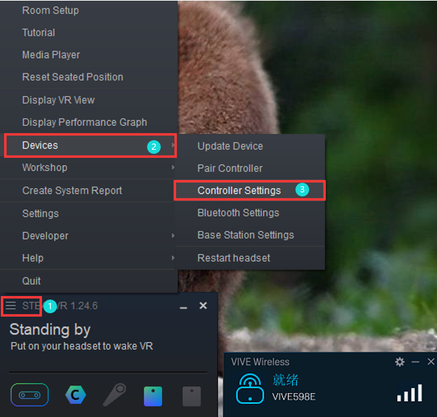

2. 进入"管理控制器绑定"

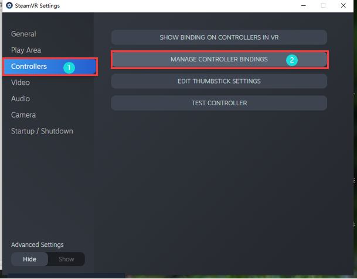

3. 选择游戏

    - 1 选择希望配置的游戏。
    - 2 设定为自定义。
    - 3 点击"选择另一个"

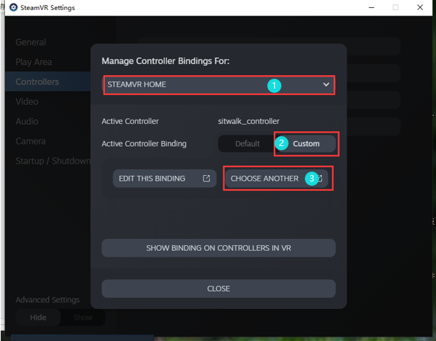

4. 设定Sitwalk为当前的游戏控制器

如图点击右侧的当前控制器，选择Sitwalk为当前控制器

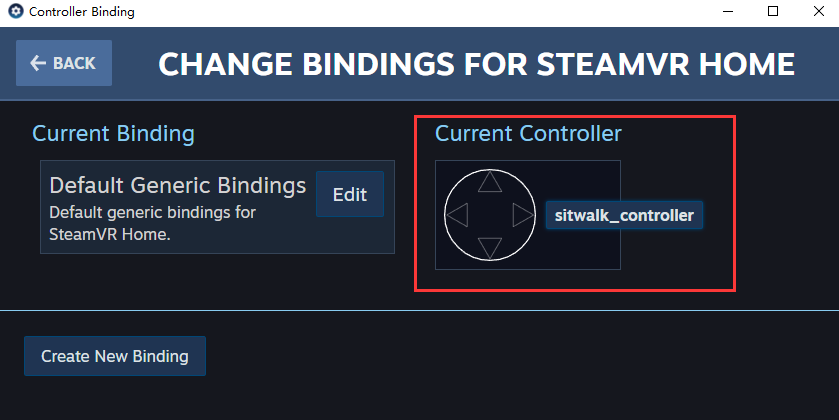

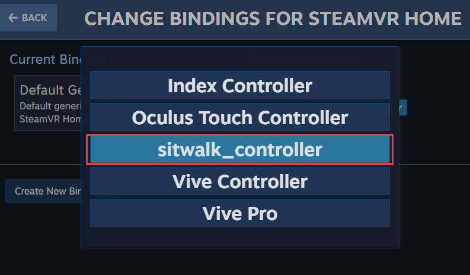

.. warning::
    注意，若此处找不到SitWalk_controller，说明驱动安装出现了问题，请参照 :doc:`SteamVR驱动<SteamVRDriver>` ，再次确认驱动安装正确。

5. 编辑控制方案
选择编辑当前的方案（图中②），或者新建一个新的方案（图中③）；
点击“编辑”后进入按键编辑界面，编辑详细介绍见本文5.4小节 :ref:`edit_configuration` 。

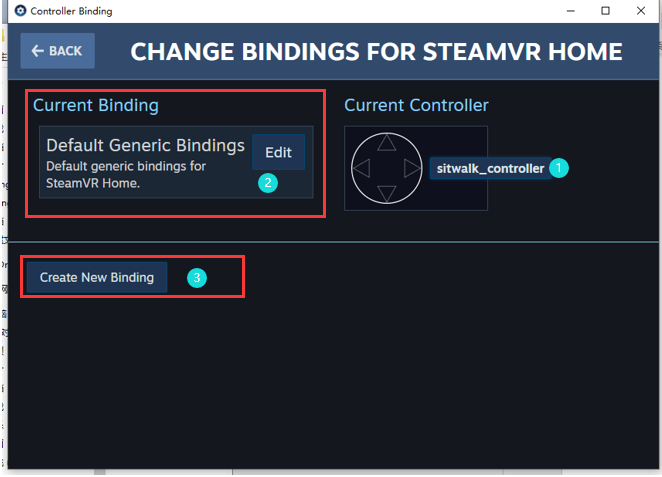

6.	控制和移动反向怎么办？

- 如果出现控制和移动方向相反的情况，可以在配置方案中找到相应的移动控制按键，点击左下角编辑按钮，再点击右下角设置按钮：

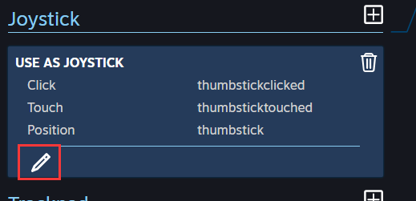

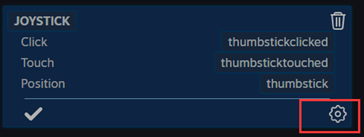

在详细设定界面中勾选反转，即可反转控制。

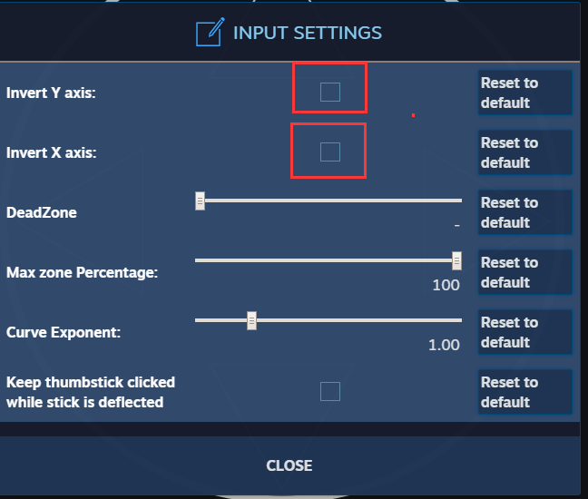

.. _edit_configuration:

如何编辑配置方案？
==================

首先我们需要了解当前游戏的移动命令，最好方法是参考游戏对其他控制器的默认绑定，例如 Index Controller、Vive Controller等。

1. 按左上角的“back”返回到控制方案的主界面，切换控制器为其他vr控制器，这里以Index Controller为例。

2. 切换为Index Controller后，左侧会显示有Steam预置好的配置方案，如下图所示，点击Edit进入。

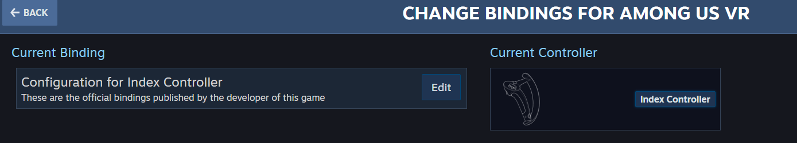

3. 找到控制移动的命令， 这个游戏在使用Index Controller的情况下，是使用左手柄的Thumbstick进行移动的（这一点通过自行使用手柄进入游戏游玩即可确定， 另外，这也是游戏的一个通用移动按键设置).

因此我们可以找到Thumbstick相关的设定，记住其设置： 

.. code-block:: c

    Thumbstick
    用作游戏手柄(USE AS JOYSTICK)
    Click : thumbstickclicked
    Touch : thumbsticktouched
    Position : thumbstick

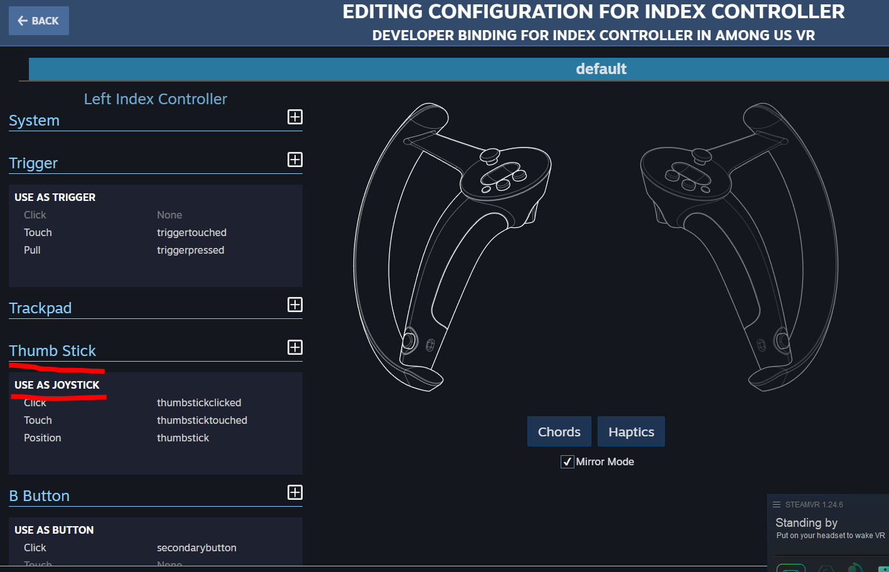
   

4. 点击左上角Back返回，切换为Sitwalk控制器，并点击Edit编辑自己的Sitwalk控制方案。

5. 在Sitwalk控制方案中参考步骤3的设定进行设置

.. note::
    Sitwalk中没有Thumbstick, 与之对等的是Joystick栏或Trackpad栏，优先选择Joystick，如果绑定无效，尝试使用Trackpad。

点击“+”创建，并选择Use As Joystick，然后依次参照第3步设置Click、Touch、Postion。

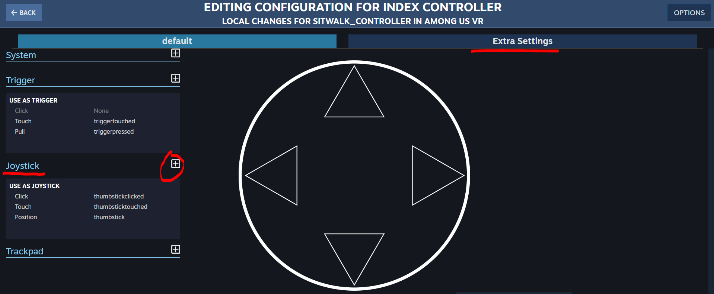

6. 设置完毕后点击（5）步骤图中右上标红部分“Extra Settings”，勾选“return bindings with left hand”。

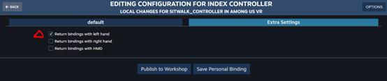

.. _share_config:

如何分享配置文件?
=================

用户可以将自己配置好的控制方案上传至SteamVR的创意工坊中，与其他用户分享使用自己的配置方案。

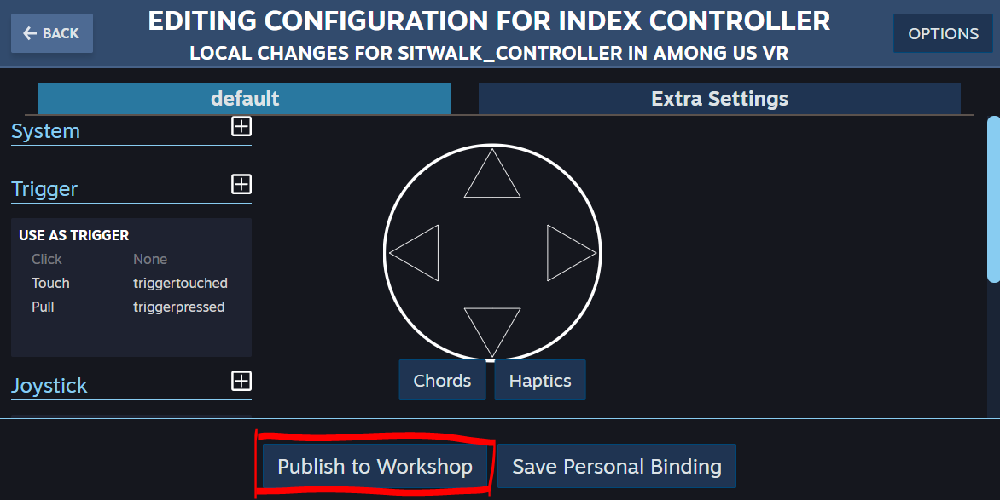

.. _use_shared_config:

如何使用他人分享的配置文件?
===========================

在按键配置方案的页面中，可以看到其他用户共享上传的配置方案，可在此处选择使用他人的配置方案来进行游戏。

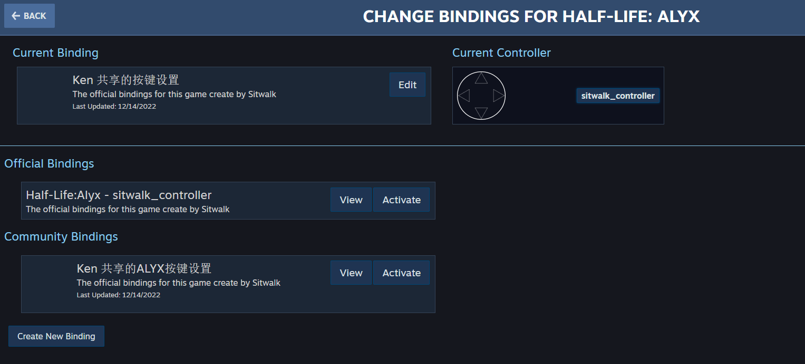