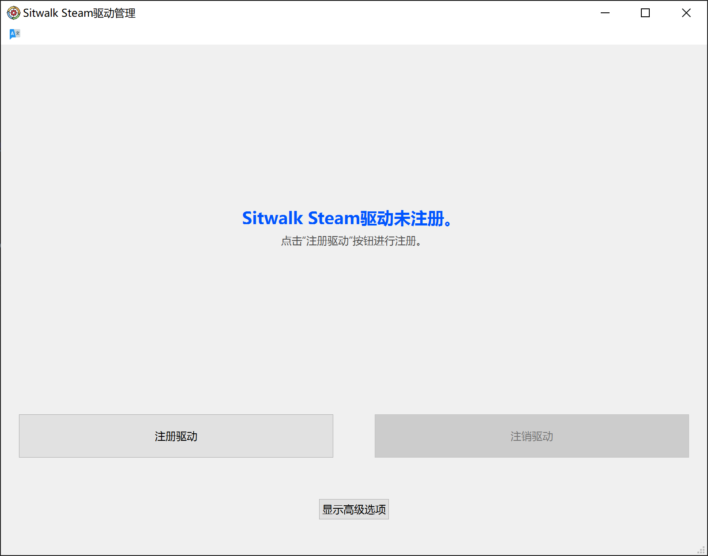
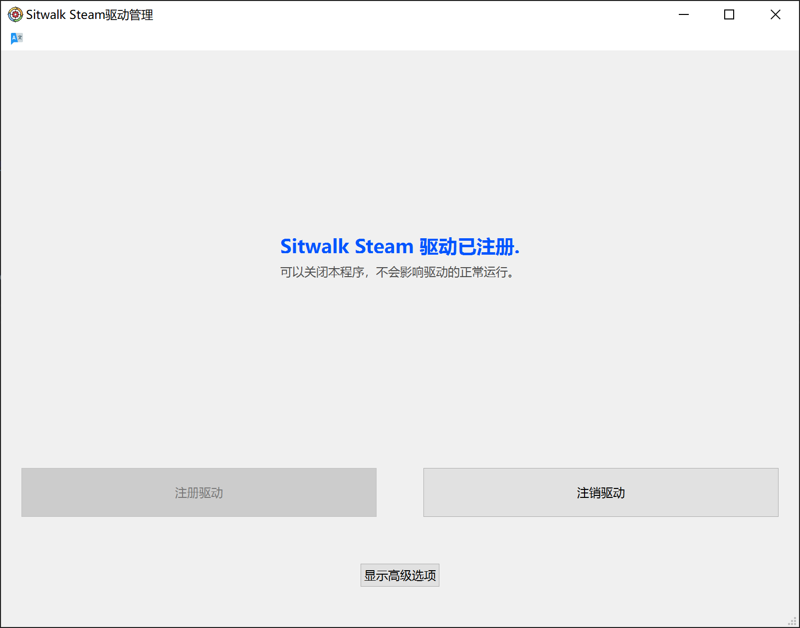
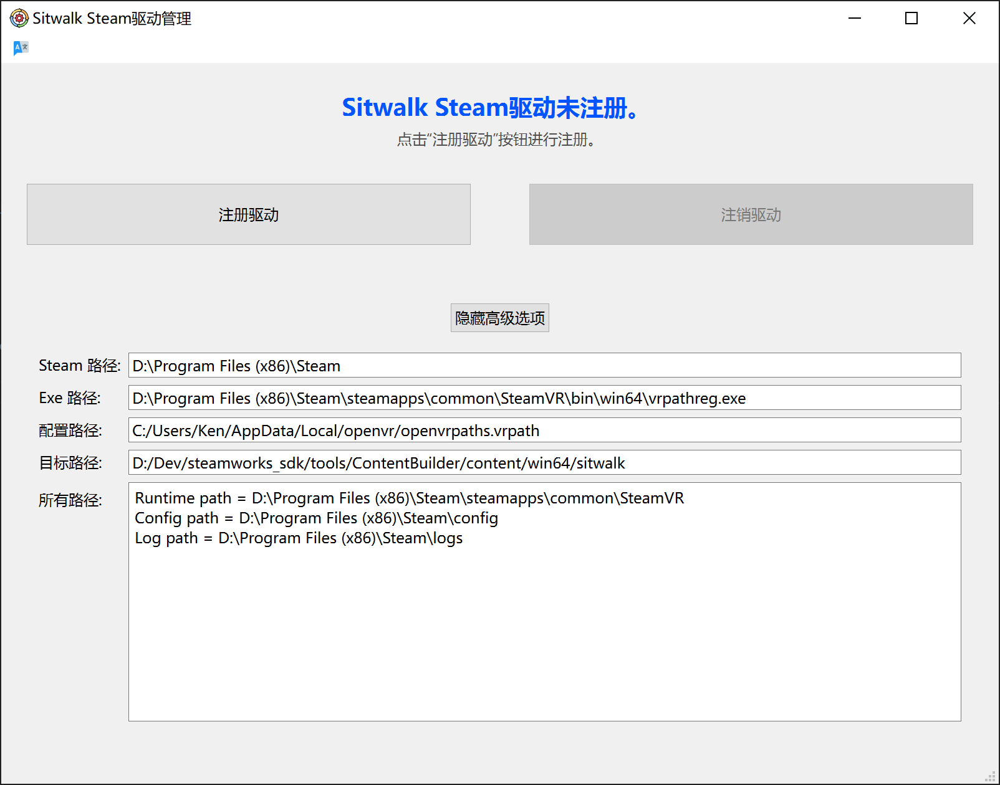

============
SteamVR 驱动
============

下载地址
========

有两个地方可以下载Sitwalk SteamVR驱动：

1. 在Steam商城中搜索Sitwalk 
2. 我们提供的 `下载地址 <https://sourceforge.net/projects/sitwalksteamdriver/files/>`_

.. note::

    选择一种方式下载即可，请勿重复下载和操作。

    该软件在一台计算机上仅需开启一次即可保证驱动工作，无需每次开机都开启。

使用说明
========

- 如果从Steam商城中下载，可以直接点击Launch即可启动。
- 如果是手动下载的，需要将文件解压缩到任意位置，并在其中找到SteamDriverManager.exe文件启动。

第一次启动软件，会出现如下界面：

点击“注册驱动",界面即变为：

之后即可关闭该窗口，不会影响驱动的工作。

高级选项
========

为了诊断可能出现的问题，软件提供了高级选项：

- Steam路径: 软件检测到的Steam安装路径，可以验证是否与实际情况一致
- Exe路径: 软件检测到的vrpathreg.exe程序的路径，该程序是SteamVR附带的小程序，用于管理SteamVR的驱动
- 配置路径: 软件检测到的openvrpaths.vrpath文件所在路径。SteamVR(openvr)的综合信息存储文件，包括外部驱动的路径
- 目标路径：当前要注册的驱动的目录，和当前这个窗口程序处于相同目录，驱动文件夹名称为sitwalk
- 所有路径：即openvrpaths.vrpath文件的所有内容，方便诊断问题

.. note::

    除非手动注销驱动或者误删了驱动文件，导致驱动错误，否则是无需进行更多的操作。

软件更新
========

除非有特殊说明，否则通过Steam商城自动更新了该软件之后，也无需进行更多操作。
如果软件是手动下载的，则只需要将新版本的软件覆盖旧版本即可。

软件卸载
========

建议在卸载之前，打开该软件，注销驱动，然后通过Steam商城卸载或者直接删除整个程序文件夹。