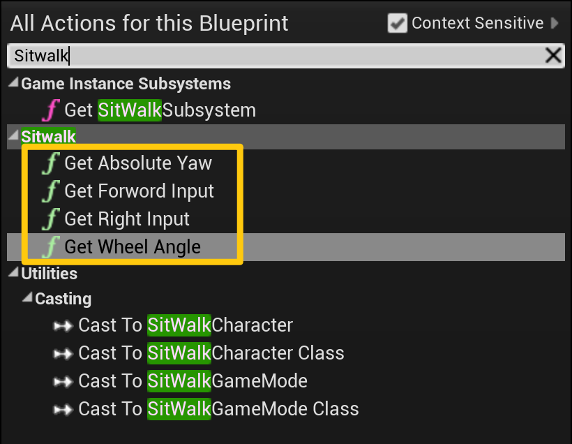

==================
Unreal Engine 驱动
==================

使用说明
========

| 将插件拷贝到虚幻C++工程的Plugin目录中，编译并运行工程

| 打开蓝图，搜索关键词"Sitwalk"，可以看到Get Absolute Yaw, Get Forward Input, Get Right Input, Get Wheel Angle几个节点, 在Tick中调用即可。

